# Turbine    
Outlined Instruction Steps:

1. Print 3D printed parts  
   1. 3 “Top” pieces  
   2. 3 “Bottom” pieces  
   3. 9 “Middle” pieces  
   4. 5 Spoke shaft collars  
   5. 1 Motor Gear  
   6. 1 Shaft Gear  
   7. [Link to files](../CAD/Turbine)  
2. Cut spokes to 15 cm (15 total spokes)

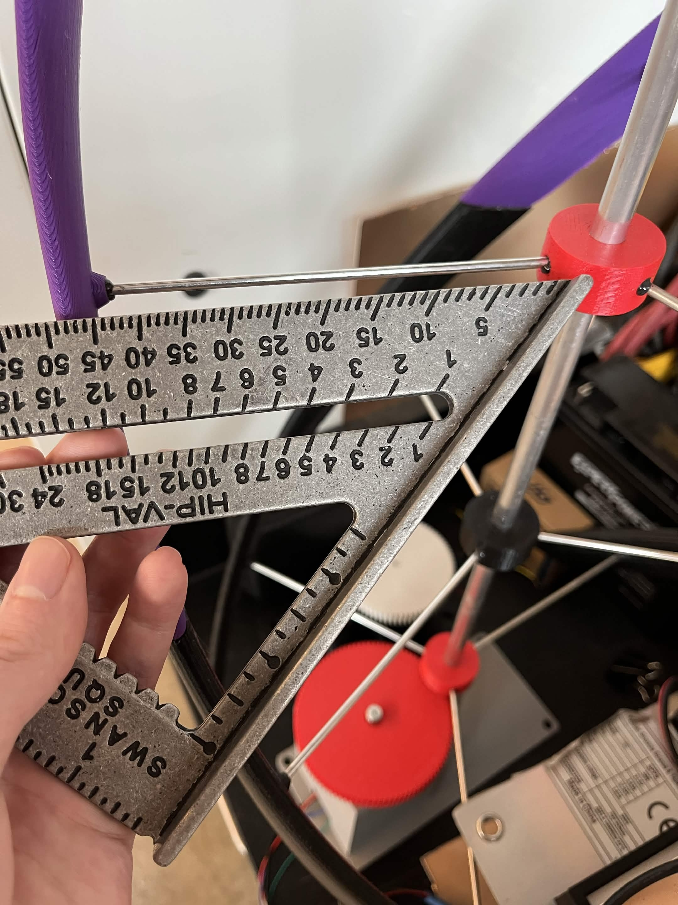

3. Place motor and bearings in place in the motor housing

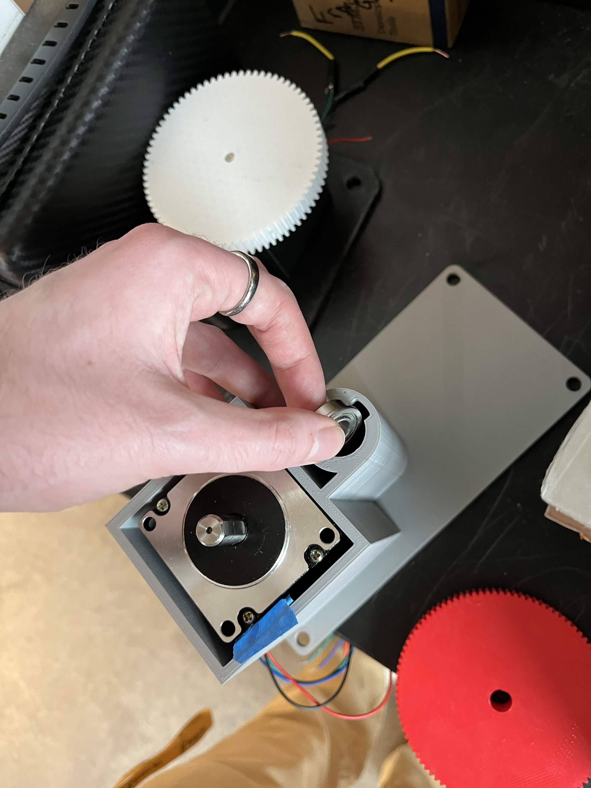
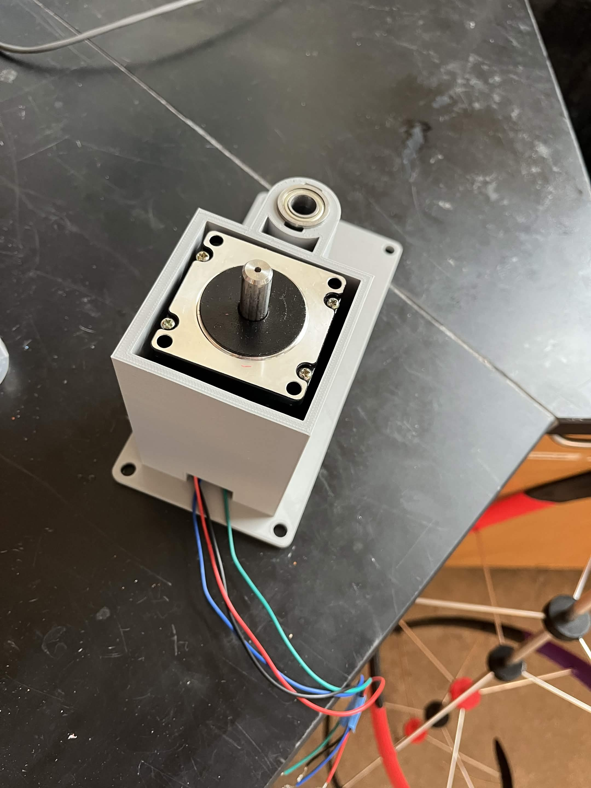

4. Put the motor gear on motor shaft

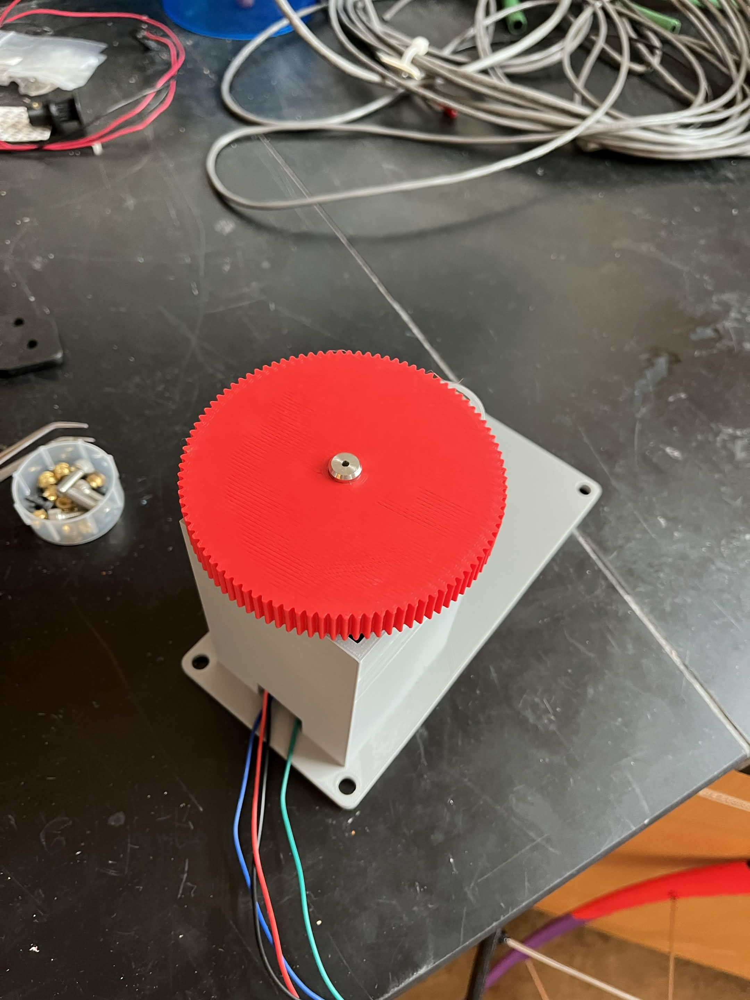

5. Epoxy / JB Weld spokes into shaft collars

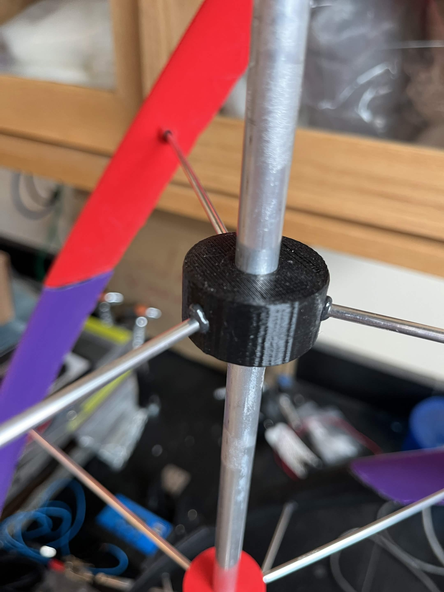

 

6. Attach shaft collar items on the shaft (shaft gear, blade attachment points) either by friction or with an adhesive (if using adhesive, wait until the blades are connected to the spokes for proper spacing)

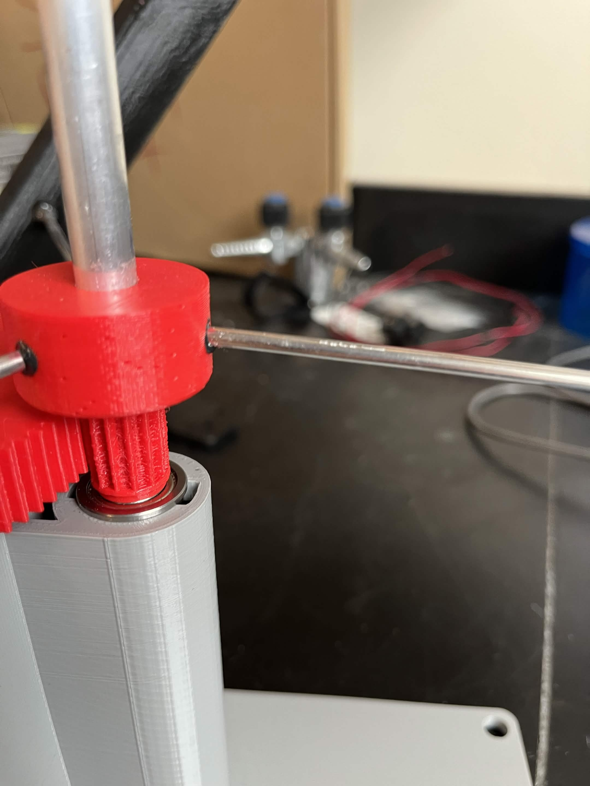
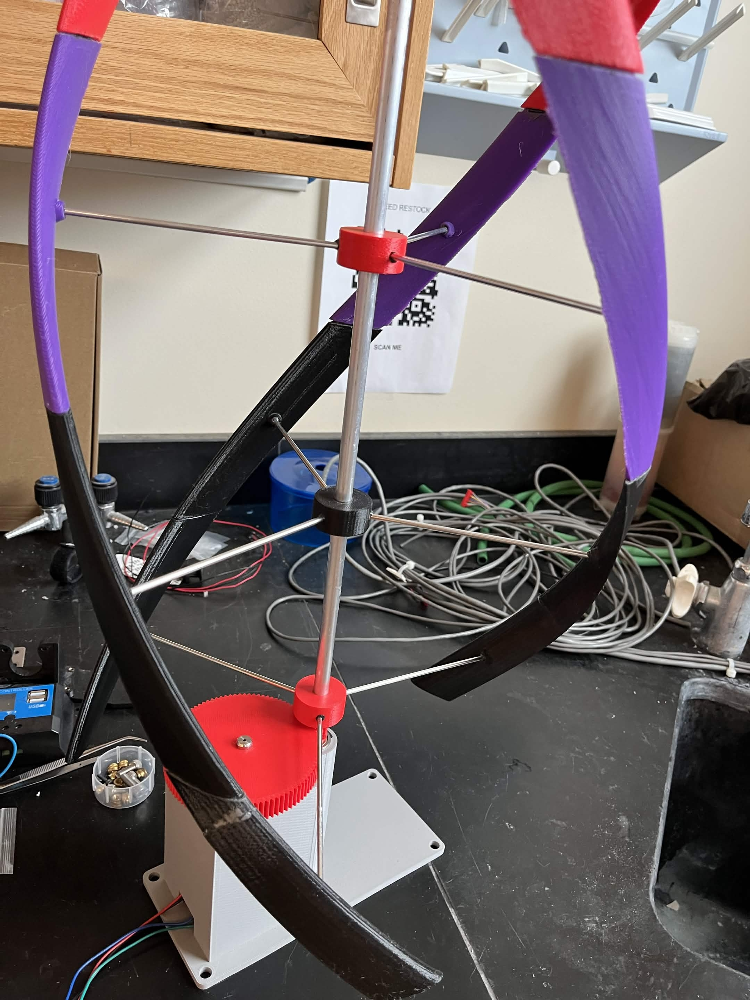
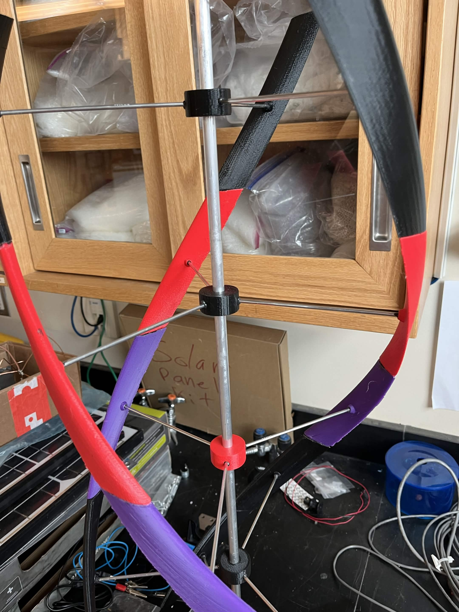

7. Epoxy / JB Weld spokes into blades while the spokes and shaft collar attachment points are on the turbine (and epoxy the blades together)

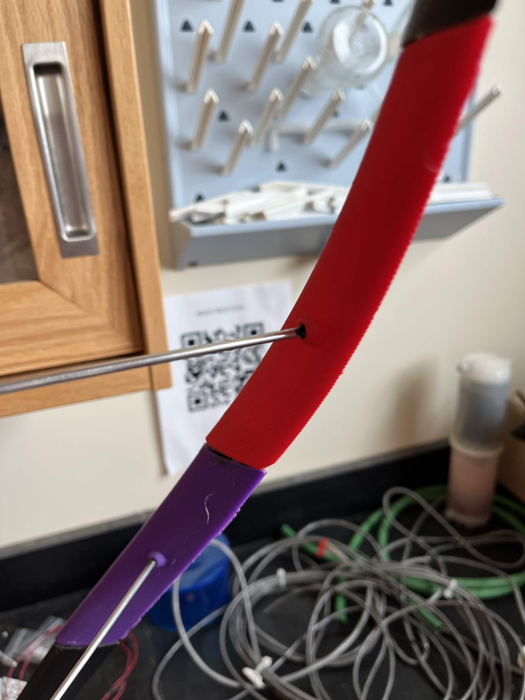

8. Once assembled the final product should look like the turbine seen below

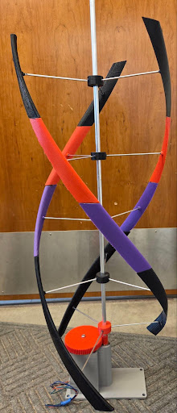

# Reader

1. Solder female headers onto a large piece of prototyping board in a manner that will alow the SparkFun M7E Hector, the Arduino, and the SD card reader to be mounted (making sure to leave room for a level shifter)  
2. Solder together the level shifter on a separate piece of prototyping board with a male header  
3. Add the appropriate female header to the main proto board  
4. Solder together all the 5V rails, 3.3V rails, and GND rails using wires and solder bridges on the bottom side of the main board  
5. Solder the Arduino's TX and RX pins to the low side of the level shifter  
6. Solder the SparkFun M7E Hecto’s TX and RX pins to the high side of the level shifter (making sure that through the level shifter, the RX pin of the Arduino board connects to the TX pin on the SparkFun board and vice versa)  
7. Follow the wiring diagram to solder the signal lines to the SD card reader and Arduino (→MISO, →MOSI, →SCK, →CS)  

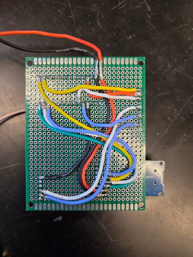

  
    
     
8. Compile and upload the code to the Arduino using the Arduino IDE

# Antenna 

1. Download the .stl file for the antenna case   
2. 3D print the case   
   1. Requires two of the same prints sides are identical  
        

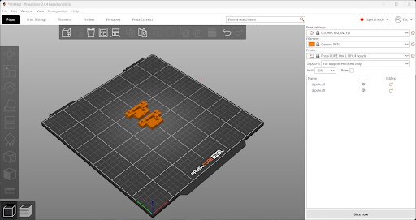

        
3. Cut 2 pieces of 8 Gauge copper wire to 73 cm  
4. Use a hammer to flat one end of the wire  
5. Drill a small hole through the flatten copper   
   1. This hole helps with thermal relief when soldering   

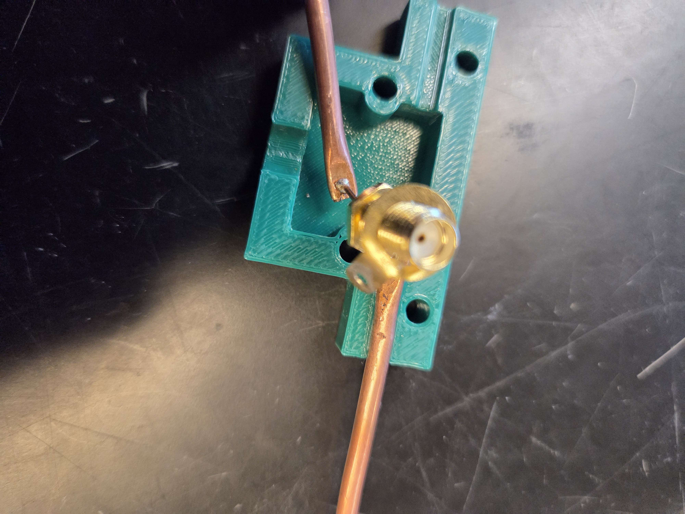

 
        
6. Solder a small wire between your SMA port and the hole in the coper wire  
   1. Make sure the wire is long enough so that the copper wire can sit in the grooves and reach the bottom where the SMA port is   

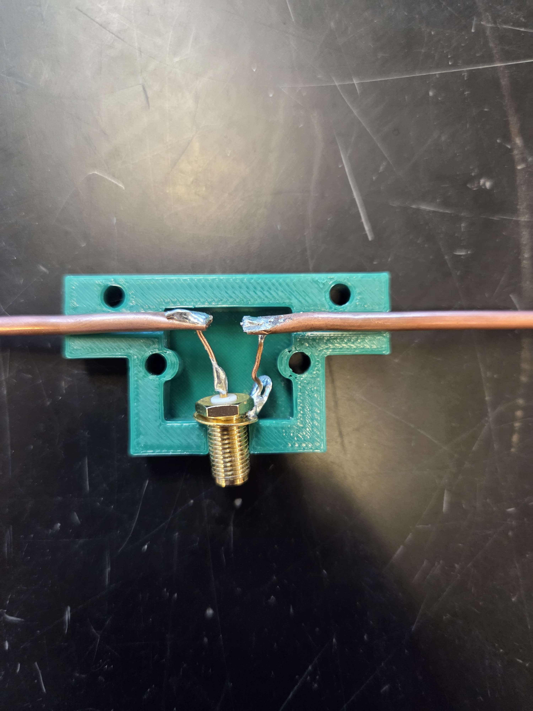

 
       
7. Confirm that copper wires and SMA port are in the proper position before screwing the two sides together  
8. Connect antenna to SMA port of reader  

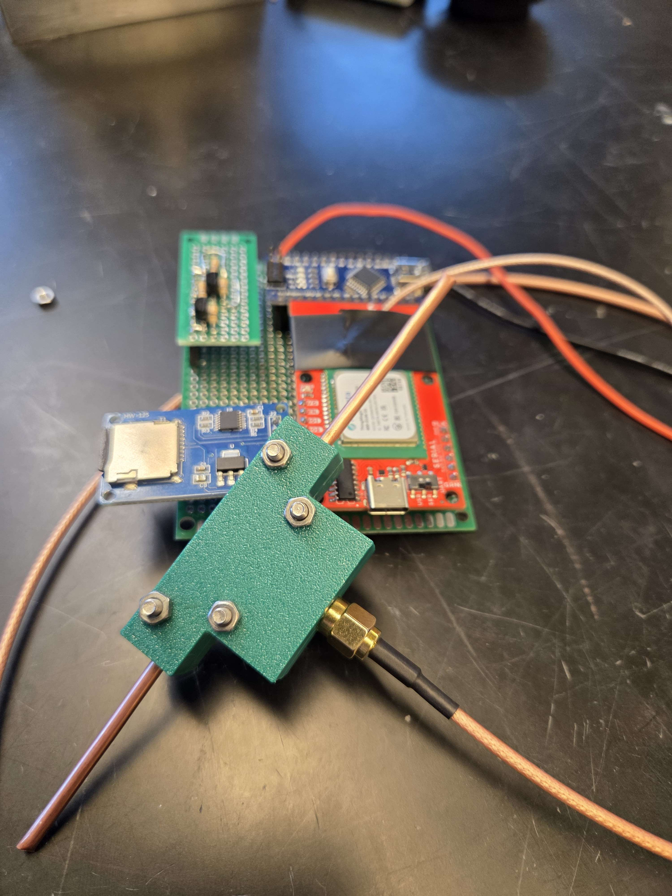

