# Echo-Net

This project aims to assist bat research by creating a small lightweight external RFID tracking device. This device would allow researchers to easily tag bats with external tags, reducing the invasiveness of the process and allowing them to obtain data on the movement of bats. 

While these devices are being developed with the intention of bats in mind their applications can stretch beyond that of bats. This project sets a platform for using small RFID tags to track not just animals but anything that can be tagged, allowing for branching in fields such as inventory management or item tracking.

Figure 1: Final Reader Prototype

# Problem Statement
In the UP bats are being killed due to an invasive fungus called the white noise fungus. This is causing a sharp decline in the bat population. A group of researchers at the Michigan Technological University CFRES Department are working to research these bats and attempt to counteract the effects of this fungus. One of their goals is to track the movement of the bats during the winter months, evaluating how they travel between hibernaculums. 

Their current strategy for tracking the bats is color tags which are attached to the wing of the bat and then manually counted through the winter to get a rough estimate of their movement patterns. The goal of this project is to design a system that utilizes small RFID tags to track the bats remotely through a system at the entrance of the cave to determine when and where the bats are moving. In addition a handheld device will also be designed for the cave to be swabbed for the current bat that are present.

# Methodology
## Overview 

To start the design a general block diagram of the system was laid out as seen in Figure 2. This system has three main sections, one of which was manually focused on this semester in the data. The power system was also evaluated, and the interrupt system was left for future semesters.

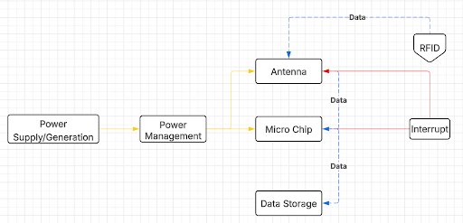

Figure 2: System Block Diagram for Reader

## Power

Solar energy was evaluated early in the design process but rejected due to the persistent snow cover that would obscure panels for weeks or months, and the maintenance challenges, as clearing snow is not feasible for this remote operation.

Given these constraints, wind energy was the only viable renewable power source capable of providing continuous, unattended operation throughout the winter season.

The turbine was developed for deployment near cave environments where bat activity is dense and unpredictable. Because of this, the mechanical subsystem had to meet strict biological safety requirements. The project guidelines emphasized that no component of the power-generation system could pose a serious risk of injury to the bats.

Traditional horizontal‑axis turbines with exposed, high‑speed blades were immediately ruled out due to their high tip‑speed ratios that could harm the bats.

To satisfy the safety requirement while still enabling continuous power generation, we selected a helical‑bladed VAWT. This geometry offers several advantages in a cave‑adjacent or wildlife‑dense environment. First, there is no high‑speed blade tips because the rotational velocity is distributed more evenly along the height of the rotor. Also, there is a smooth, continuous surfaces that reduce the likelihood of injury upon incidental contact. Additionally, it has omnidirectional operation, eliminating the need for yaw mechanisms or exposed linkages. Another benefit is its lower startup torque compared to some HAWT designs, which is beneficial in low‑wind cave entrances. The helical profile also ensures more uniform torque production over the rotation cycle, reducing vibration and mechanical stress on the generator shaft.

The entire embedded system requires a small but continuous power budget. Based on preliminary load analysis of the RFID reader, microcontroller, and data‑logging components, the turbine was designed to produce 0.5–1 W under typical winter wind conditions.

To meet the 0.5–1 W requirement, the a NEMA 23 stepper motor was chosen for the design, which demonstrated an approximate 12 V peak‑to‑peak open‑circuit voltage when spun manually at expected speeds.

## Data

The first part of the data system is the reader design, this encompasses the microcontroller and module board for reading the data from the tags as well as storing it on our SD card for later data analysis.
	
For our reader module we utilized the SparkFun Simultaneous RFID Reader M7E Hecto board, this board is able to read UHF RFID such as the ones that we are using. By utilizing this development board we were able to reduce the complexity of our RFID reader ensuring increasing the speed in which we could develop a working prototype and test the other components of our system.

For the microcontroller of our project we used an Arduino Nano. We chose to use this to do the simplest of implementing, there was discussion about using an Atmega328-PU for reduced power consumption but due to the ease of implementations of the Nano we ultimately went with it. In the future if power consumption becomes a problem the design may be changed to utilize something other than an Arduino to reduce power.

The rest of the reader design consisted of a logic level shifter and a SD card module. The level shifter allows for the 5V logic of the Arduino to be shifted to the 3.3V of the SparkFun M7E Hecto board. The SD card was used to store the data that was collected by the device for later data manipulation. A full schematic over our design can be seen in Figure 3.

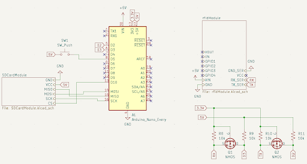

Figure 3: Reader Schematic

The code for the reader is relatively simple. It leverages the example code from the SparkFun_UHF_RFID_Reader library constant reading example. With the addition of writing to the SD card through some simple helper functions the data collected on the SD card can be seen in Figure 4. There is also an option to enable a required trigger hold in order to start reading.

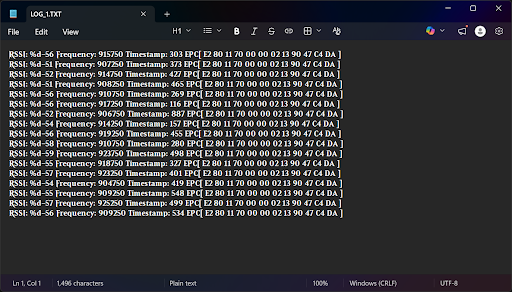

Figure 4: SD Card Data Collection Readout

The next stage in our data collected system is the antenna that is used to transmit to the tags. Three designs for an antenna were initially tested, a helical antenna, a clover leaf antenna, and a half dipole antenna. 

A ½ wave dipole antenna was decided on and constructed using copper pipe and a 3D-printed body. This resulted in an antenna that was durable, simple to construct, and lightweight/mobile. The dipole antenna was only decided on after both attempting to create other styles of antennas such as a helical and cloverleaf antenna, and after testing some 915MHz antennas we had lying around. 

The helical antenna was not selected due to its large size and directionality. It was difficult to get it aligned properly which resulted in missed reading. In addition its large size made it impractical for a hand held antenna. The cloverleaf's setbacks were in the form of its fragility and lower read range. With there being little structure to the cloverleaf, concerns around its ability to survive a winter in the cave resulted in the decision to favor the more robust half dipole design.

The initial design of this antenna was done in Matlab antenna designer, with a rendering of the half dipole antenna being seen in Figure 5. In addition the directivity of the antenna can be seen in Figure 5. This shows that the antenna can read the tags in any direction as it is circularly polarized.  Finally an S11 plot is in Figure 6, this plot as a dip at 915 MHz down to -15dB which shows that the antenna is most efficient at a frequency of 915 MHz which is desired.

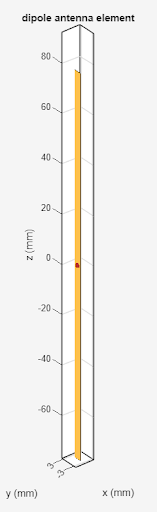

Figure 5: Half Dipole Antenna Design

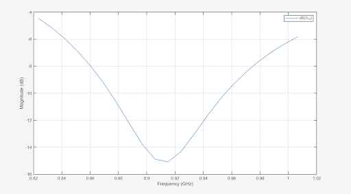

Figure 6: HalfDipole Antenna S11 Plot

The final part of our design was the selection of a tag which is attached to the bat. The tag was the Impinj Monza R6P, which can be read between the frequencies of 860 - 940 Mhz. It also has a small size of 2.6x2.6x0.8mm which help to reduce the weight that is attached to the bat.

Figure 7: Example of a Tag and Band Attached to a Bat

In addition to the tags internal antenna which is very small a circular antenna was attached to the tag as seen in Figure 8. This was done to increase the read range and directionality of the tag. By utilizing this the read range was able to be significantly increased along with making the tag easier to read in different orientations.

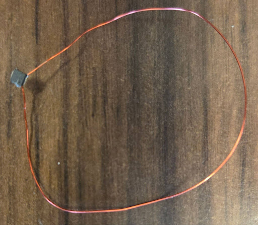

Figure 8: Tag with Circular Antenna

# Results
## Power
The current motor in our turbine design can produce around 12V when spun in ideal condition as seen in Figure 9.  

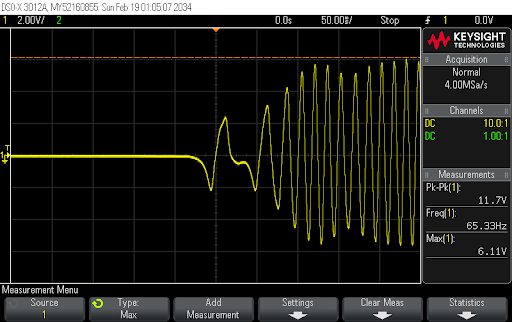

Figure 9: Oscilloscope Readings 

To determine the amount of power that needed to be generated the power consumption of the read was measured at different dB output. The results of the this testing can be seen in Figure 10. The general operating range of this device is between  20-27 dB which means that on average  it will be consuming between 2-2.85 watts. This means that having the power completed provided my the turbine is impractical. To compensate for this battery options were evaluated.

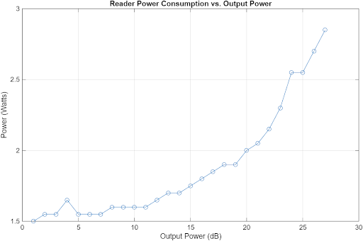

Figure 10: Read Power Consumption based on Output dB

The first battery option evaluated was a car battery that would be left at the stationary site to supplement the turbine. Assuming a car battery of 12.8V and 60 Ahr it can be determined that there 786 Whr. Assuming that there is 90% efficiency in the step down to operating voltage and that the battery should not be operated below 50%, as recommended for lead acid batterying the device could be powered for 3.83 days straight. 

Another option that was evaluated was a hand held power brick used for charging phones. An example that was found commercially available had an estimated 20,000 mAhr at 3.7V which equates to 74 Whr. Assuming the same 90% efficiency that was had with the car battery it was determined that the device could be powered for 17.8 hrs. This provides a viable hand held power solution in a light weight portable package

## Data

Using a Micro VNA the characteristics of out half dipole antenna were measured as seen in Figure 11, and summarized in Table x. This data is closely aligned with the that of the simulation with the desired S11 LOGMAG being around -15 dB and the impedance of the antenna being 50 Ω. 

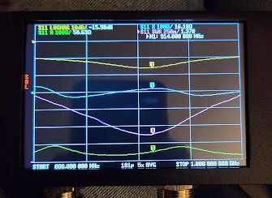
	
Figure 11. Nano VNA Data for Half Pole Antenna

 

Table 1. Data from Nano VNA for Half Pole Antenna 
| Parameter        | Setting | Value    |
|------------------|--------|----------|
| S11 LOGMAG       | 10 dB  | -15.98 dB |
| S11 R            | 100 Ω  | 50.63 Ω  |
| S11 X            | 100 Ω  | 16.19 Ω  |
| SWR              | 250 m  | 1.378    |

With this antenna design the read range was measured with 4 different configurations as seen in Figure 12. The first one was with the tag on the mental band. With this configuration no read range was able to occur. This was hypothesized to be due to the JB weld that was used to connect the tag to the band. This is further supported by the fact that when the tag is removed from the band but left in close proximity to the band the tag can be read. This leads to the belief that it is not the metal of the band that is hindering the read range. 

The next configuration that was tested was the tag with no band or additional antenna. The read range in this configuration was very limited, only around a few centimeters and was very orientation dependent. 
To compensate for the short read range a loop antenna was added to the tag to increase the range. This had an immediate effect with the read range jumping up to 1-1.5 meters and the tags being less orientation dependent while being read. In addition while not being consistent that the maximum range the tags were detected up to was 2.5m. 

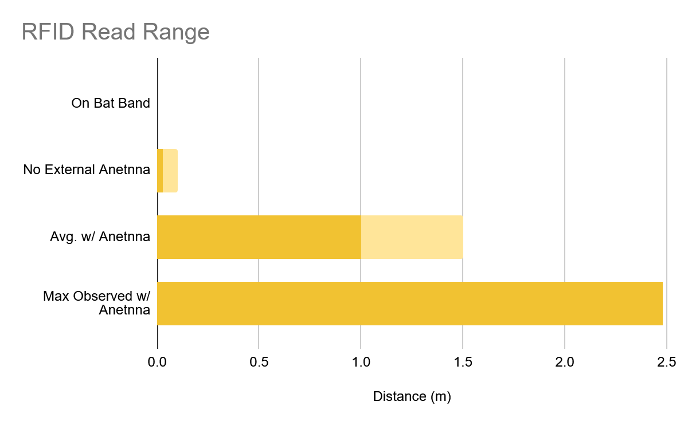

Figure 12. Read Range of the Tags in Different Configurations

# Future Work
To advance this project forward custom flex PCBs will be designed such as the reference in Figure 13. This flex PCB will then be epoxied to the banners with the additional loop antenna confined with them. To determine the optimal antenna design multiple lengths, widths, and dielectrics will be tested. By creating a swab of these antenna designs it will be able to determine the ideal design for read range. 

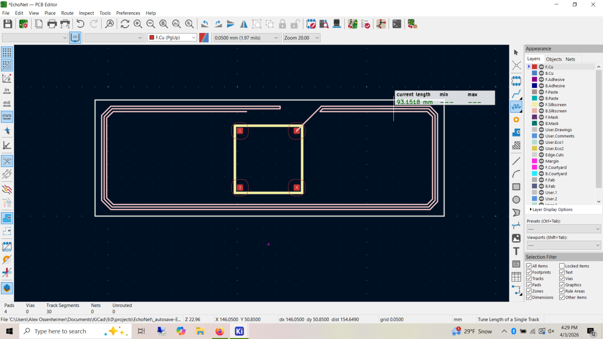

Figure 13. Mock-Up of Possible PCB Antenna 

In addition to this a PCB will also be designed for the reader design. Currently it is only a prototype board which works great for testing and rapid prototyping but for future designs a PCB will be made to make it more robust and easier to assemble. 
Additional testing also needs to be completed for battery option testing. Two options were evaluated for viability but neither has yet been tested to confirm life span. In addition the trickle charge from the wind turbine should be added into the life span of the car battery option. In addition to this to decrease power consumption low power interpret monitoring can also be evaluated.
